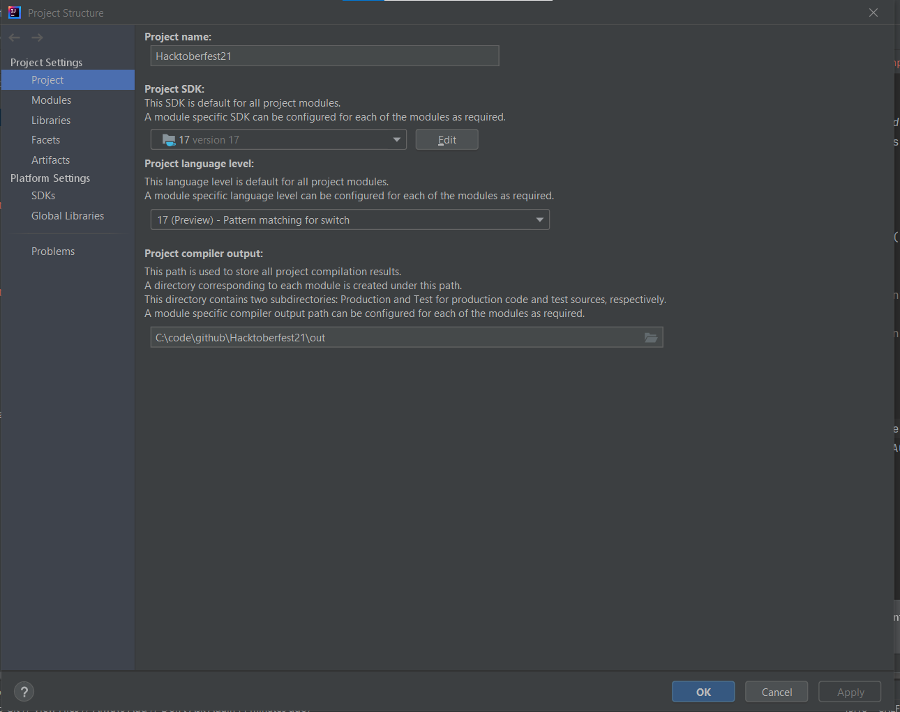

## Java 17 Language Features
#### This project showcases 2 language features:
1. Sealed classes
2. Pattern matching in switch statements

### Example used
* The example used is an `Employee` class that permits two subclasses
* Each subclass has a different bonus percentage
* The user enters their annual salary and whether they are a member of management.
* The bonus award is printed on the screen.

### Running the example
* In `Application.java`, right click and run the `main` method.

### This project uses a Java 17 "preview" feature
* Please set the project language feature to `17 (Preview) - Pattern Matching for switch`

### Note for `Sealed` classes
* In the `com.fun.noswitch` package, if you open `Supervisor.java`, you will see instructions to see the compiler's warnings.